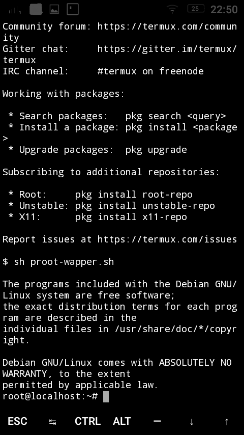

# Proot-wrapper
Chroot no Termux para Debian armhf

- Baixe o aplicativo Termux no Google play store
- Inicie o aplicatilvo
- Baixe o proot-wrapper
- $  apt-get update
- $  apt-get install debootstrap root-repo wget
- $  mkdir -p stable 
- $  dpkg --print-architecture
- $  debootstrap --arch=arm64 --variant=minbase stable stable http://ftp.debian.org/debian
- $  mkdir -p stable/media/sdcard
- $  sh proot-wrapper.sh
- 

